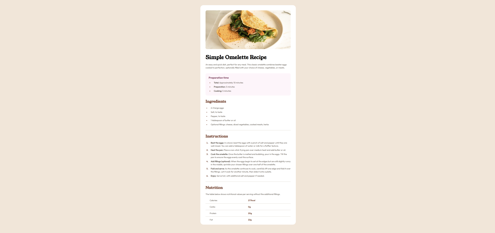

# social-links-profile

## Table of contents

- [Overview](#overview)
  - [Screenshot](#screenshot)
  - [Links](#links)
- [My process](#my-process)
  - [Built with](#built-with)
  - [What I Learned](#what-i-learned)
- [Author](#author)

## Overview

The Recipe Page is a responsive web project designed to showcase a simple yet visually appealing recipe card. Built using HTML and CSS, it integrates structured content, custom typography, and adaptable layouts. The page provides a complete recipe, including an image, preparation details, ingredients, instructions, and nutritional information, offering an engaging and user-friendly experience.

## Features:

1. Recipe Content:

   - Displays a recipe for a "Simple Omelette" with a header, description, and image.
   - Sections for preparation time, ingredients, cooking instructions, and nutritional values.

2. Typography & Styling:

   - Custom fonts defined with @font-face, enhancing readability and aesthetics.
   - Preset text styles (e.g., text-preset-1, text-preset-4) for consistent sizing and spacing.

3. Responsive Design:

   - Layout adapts for various screen sizes using media queries.
   - Adjustments for smaller devices include image resizing and layout simplifications.

4. Custom Colors:

   - Leveraged CSS variables (--stone100, --brown, etc.) for consistent theming.
   - Styled components such as buttons, dividers, and text using a cohesive color palette.

5. Reusable Components:
   - CSS classes designed for reusability across similar pages or sections.
   - Grid and Flexbox used for alignment and spacing without redundancy.

### Screenshot

### Links

- Live Site URL: (https://recipe-page-kappa-virid.vercel.app/)

## My process

Approach:
I structured the recipe page by breaking it into logical sections, including the header, prep-time, ingredients, instructions, and nutrition. Each section was grouped and styled to ensure a consistent flow of information. My goal was to design a clean, visually appealing interface that remains responsive across various screen sizes.

To achieve this, I used a combination of Flexbox and CSS Grid for layout and alignment. Flexbox was ideal for centering and aligning elements, while CSS Grid allowed me to manage complex layouts, like the nutrition table, with precision and flexibility.

### Built with

- Semantic HTML5 markup
- CSS
- Flexbox
- Grid

### What I learned

In this project, I stepped back a little and read through all the available html tags and utilized some of them for this project, such as hr, b, ol, ul and li. Utilizing these elements made the project go a lot smoother and easier compared to styling divs and making them look like the mentioned elements.

## Author

- Website - [Rodel Advincula](https://recipe-page-kappa-virid.vercel.app/)
